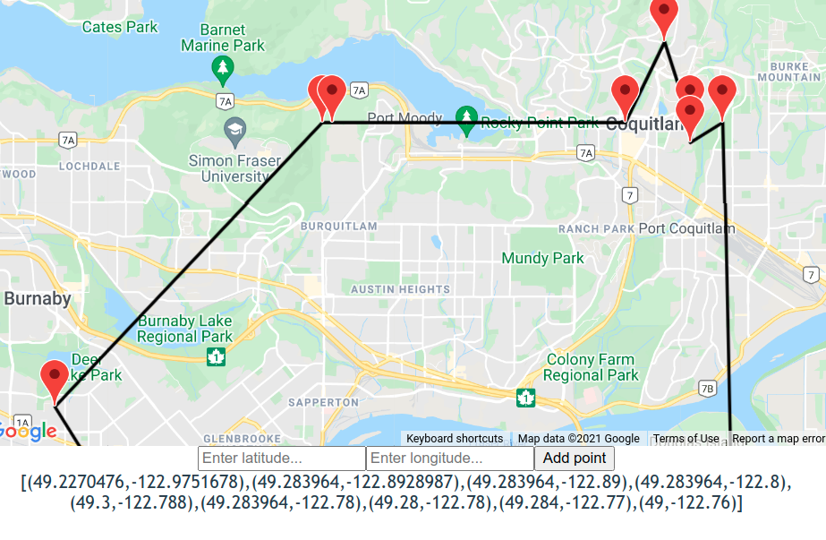
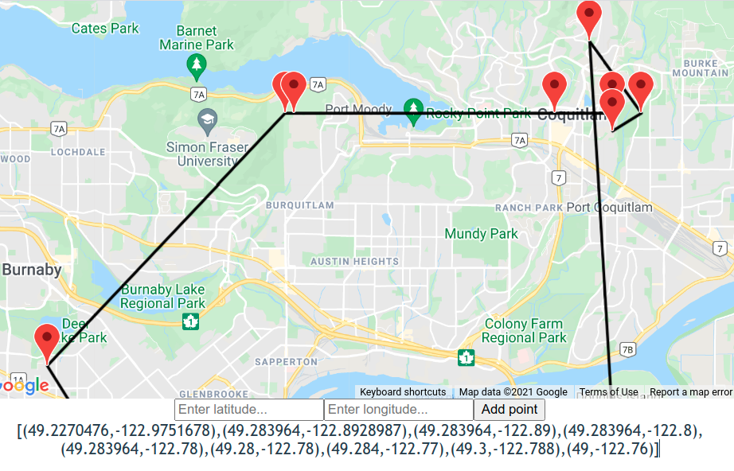

# Elm project

## How to run

Install dependencies,
```
$ npm install
$ elm install PaackEng/elm-google-maps
```

Run the application with Google Map API key,

```
$ ELM_APP_GOOGLE_MAP_KEY='key' elm-app start
```

Currently, the application can only run in development mode because there is no backend for Google Map API requests.

**Note**: Follow [this to enable API](https://developers.google.com/maps/gmp-get-started#enable-api-sdk) and [enable billing](https://console.cloud.google.com/projectselector2/billing/enable) to get Google Maps API key; choose API for `Maps JavaScript API`.

## Challenges

Setting up Elm was not difficult, however details such as passing environment variables and drawing on canvas took me considerable time. In order to use transpiled `.elm` files, I would need to setup backend API so that it does not expose Google Map Api key. Initially, I have attempted to draw coordinates on a HTML canvas but I could not get `elm-canvas` to draw on canvas even with their provided examples.

The algorithm used is Nearest Neighbour with the first coordinate point in a list being the starting position. Additional improvement would be use is Nearest Fragment but the approach can still result in suboptimal solutions. I have attempted to implement Christofides and Serdyukov algorithm but got stuck on finding minimum-weight perfect matching which would take me much more considerable time to understand and implement it.

The distance is measured in terms of Euclidean distance which assumes that points are on the same plane. So better approach would be to calculate distance using haversine algorithm.

## Below is the walkthrough as I implemented the Elm application

```
npm install -g elm
```

Initialize project

```
elm init
```

This is will create `elm.json` file and `src/` directory. The main file Elm looks for is `src/Main.elm`, it should have a header as follows

```elm
module Main exposing (..)
```

Then launch the application 

```
elm reactor
```

Launch interactive shell, then an `.elm` file can be loaded as a module
```
$ elm repl
> import TSPalgorithms exposing (..)
```

Later, I Initialized project with `elm-app` in order to pass environment variable

```
$ create-elm-app project
$ cd project && elm-app start
```

## Syntax

Records
```elm
>  john =
|   { first = "John"
|   , last = "Hobson"
|   , age = 81
|   }
| 
{ age = 81, first = "John", last = "Hobson" }

> john.last
"Hobson"

> .last john
"Hobson"

> List.map .last [john, john]
["Hobson", "Hobson"]

> {john | last "Adams" }
{ age = 81, first = "John", last = "Adams" }
```
source: https://guide.elm-lang.org/core_language.html

Elm consists of three main components: Model, View and Update. Model tracks the state of application, View produces HTML, and Update updates the state of Model.


In order to use pattern matching, we need to use `case` expression, for example

```elm
appendMap : a -> List (List a) -> List (List a)
appendMap item lists =
    case lists of
        [] -> [[item]]
        xs -> List.map (\sublist -> List.append sublist [item]) xs
```

In addition, each block of expression needs to indented with the same amount of space. Otherwise, there is an compile error.

The variable names cannot be reused within a subblock.

## Travelling salesman problem

### Brute force

We can generate all possible permutations of coordinate points and find the set of points that produce the smallest sum of their distances. But the permutations produces `n!` orderings so it is not feasible.

### Nearest neighbour 

The Nearest neighbour algorithms choose a random starting point and travels to the next nearest point. Then, it is treated as an origin point and again we look for the nearest point.


Below, we can see the comparison between optimal and greedy approach. Greedy approach using nearest neighbour finds solution in polynomial time but it can be far from the optimal solution.

 


### Christofides and Serdyukov approximation algorithm

The first step of Christofides and Serdyukov algorithm is to find a minimum spanning tree, that we can get using Kruskal algorithm.

Below is the walkthrough how I implemented Kruskal algorithm, however the next step of finding perfect matching of minimum weight could not be implemented due to time constraints.

#### Find minimum spanning tree

We need to implement Union-Find data structure used in Kruskal algorithm. For simplicity, I am using `List` to store disjoint sets so the time complexity to find an element is at worst `O(n log(m))` where `n` is the number of disjoint sets and `m` is the size of the biggest set.

``` elm
findDisjointSetTupleAcc : comparable -> List (Set comparable) -> List (Set comparable) -> (Set comparable, List (Set comparable))
findDisjointSetTupleAcc point list leftSets =
    case list of
        (set :: sets) -> if Set.member point set then (set, List.reverse leftSets ++ sets)
                         else findDisjointSetTupleAcc point sets (set :: leftSets)
        [] -> (Set.empty, leftSets)

findDisjointSetTuple point list = findDisjointSetTupleAcc point list []
```

Next, we need a function to determine if two elements are in the same disjoint set.

``` elm
inTheSameDisjointSet : comparable -> comparable -> List (Set comparable) -> Bool
inTheSameDisjointSet p q sets =
    let (pSet, _) = findDisjointSetTuple p sets
    in Set.member q pSet 
```

Since only coordinate points are given, we form edges by considering all pair-wise combinations.

``` elm
edgesForCompleteGraph : List a -> List (a, a)
edgesForCompleteGraph list =
    let getPairs list0 firstPair = List.map (\secondPair -> (firstPair, secondPair)) list0
        recurseGetPairs list1 leftList =
            case (list1) of
                (x :: xs) -> List.append (getPairs (leftList ++ xs) x) (recurseGetPairs xs (leftList ++ [x]))
                [] -> []
    in recurseGetPairs list []
```

Now, we can implement Kruskal algorithm. We sort edges by computing their Euclidean distance. Each node forms a disjoint set in a list. Once iterating over ordered edges, we check if two-end points of an edge are not in the same disjoint set, meaning adding the edge does not create a cycle.


``` elm
minSpanTree : List Node -> List Edge -> List Edge
minSpanTree nodes edges =
    let orderedEdges = List.sortBy distanceTuple edges
        disjointSets = List.map Set.singleton nodes
        iterateEdges edges0 sets minSpan =
            case edges0 of
                ((u, v) :: es) ->
                    if not (inTheSameDisjointSet u v sets)
                    then iterateEdges es (unionDisjointSets u v sets)  ((u, v) :: minSpan)
                    else iterateEdges es sets minSpan
                [] -> minSpan
    in iterateEdges orderedEdges disjointSets []
```

## Drawing the coordinate path

I have attempted using `elm-canvas` package but the resulting `<canvas>` did not draw anything.

We will use Google Maps API instead. For that, we need to get google API key. Follow [this to enable API](https://developers.google.com/maps/gmp-get-started#enable-api-sdk) and [enable billing](https://console.cloud.google.com/projectselector2/billing/enable).

Install elm package for Google Maps from [github](https://github.com/PaackEng/elm-google-maps/tree/2.1.0).

To get input from user, we need to define message types that track changes to input fields

``` elm
type Msg 
    = Coordinates 
    | LatitudeInput String
    | LongitudeInput String
```


Then trigger them via event handlers

``` elm
input [placeholder "Enter latitude...", onInput LatitudeInput] [],
input [placeholder "Enter longitude...", onInput LongitudeInput] [],
button [onClick Coordinates] [text "Add point"]
...
```

The `update` function handles events. From there we can check which event is being triggered. In our case, the inputs are converted to `Float`s if the conversions success otherwise the wildcard `_` catches other instances. In `elm`, pattern matching must cover all cases otherwise it will not compile. 

We can make use of `model` to access of its members similar to JS object and compute new coordinate path,

``` elm
update : Msg -> Model -> (Model, Cmd Msg)
update msg model =
    case msg of
        LatitudeInput lat -> ({model | latitudeInput = lat}, Cmd.none)
        LongitudeInput lng -> ({model | longitudeInput = lng}, Cmd.none)
        Coordinates -> (case (String.toFloat model.latitudeInput, String.toFloat model.longitudeInput) of
                            (Just lat, Just lng) ->  
                                let optimized = nearestNeighbour (List.append model.coordinates [(lat, lng)])
                                in {model | coordinates = optimized}
                            _ -> model
                            , Cmd.none)
```

